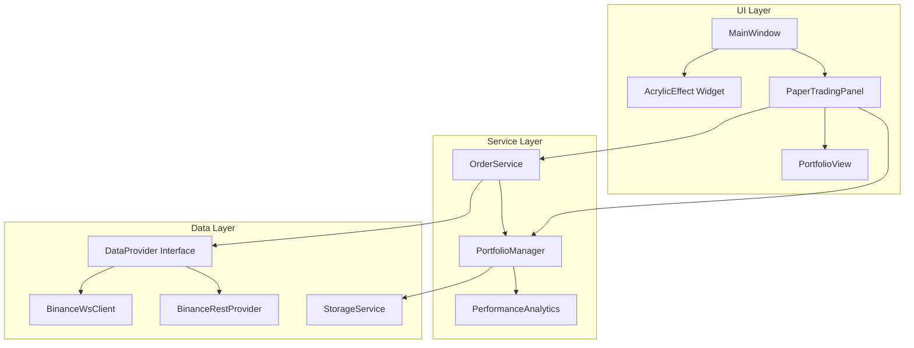

# Design Document: Modern UI/UX & Virtual Market Simulation

## Overview

本設計文檔描述 Crypto Ticker 應用程式的兩個主要增強功能的技術實現方案：

1. **現代化 UI/UX** - 使用 PySide6 的 QGraphicsEffect 和自定義樣式表實現毛玻璃效果、流暢動畫和增強視覺層次
2. **虛擬市場模擬** - 基於真實數據流的模擬交易系統，包含投資組合管理、訂單執行和績效分析

## Architecture



## Components and Interfaces

### 1. Acrylic Effect Module (`app/ui/acrylic.py`)

```python
from abc import ABC, abstractmethod
from PySide6.QtWidgets import QWidget
from PySide6.QtGui import QColor

class IAcrylicEffect(ABC):
    @abstractmethod
    def set_blur_radius(self, radius: int) -> None: ...
    
    @abstractmethod
    def set_tint_color(self, color: QColor, opacity: float) -> None: ...
    
    @abstractmethod
    def is_supported(self) -> bool: ...

class AcrylicWidget(QWidget):
    """Widget with frosted glass background effect."""
    
    def __init__(self, parent=None, blur_radius: int = 20, 
                 tint_opacity: float = 0.7) -> None: ...
    
    def apply_theme(self, mode: str, accent: QColor) -> None: ...
```

### 2. Portfolio Manager (`app/trading/portfolio.py`)

```python
from abc import ABC, abstractmethod
from dataclasses import dataclass
from datetime import datetime
from typing import Dict, List, Optional
from decimal import Decimal

@dataclass
class Position:
    symbol: str
    quantity: Decimal
    average_cost: Decimal
    
    @property
    def total_cost(self) -> Decimal: ...

@dataclass
class Transaction:
    id: str
    symbol: str
    order_type: str  # "BUY" | "SELL"
    quantity: Decimal
    price: Decimal
    timestamp: datetime
    
    @property
    def total_value(self) -> Decimal: ...

class IPortfolioManager(ABC):
    @abstractmethod
    def get_balance(self) -> Decimal: ...
    
    @abstractmethod
    def get_positions(self) -> Dict[str, Position]: ...
    
    @abstractmethod
    def get_position(self, symbol: str) -> Optional[Position]: ...
    
    @abstractmethod
    def get_portfolio_value(self, prices: Dict[str, Decimal]) -> Decimal: ...
    
    @abstractmethod
    def get_unrealized_pnl(self, symbol: str, current_price: Decimal) -> Decimal: ...
    
    @abstractmethod
    def execute_buy(self, symbol: str, quantity: Decimal, price: Decimal) -> Transaction: ...
    
    @abstractmethod
    def execute_sell(self, symbol: str, quantity: Decimal, price: Decimal) -> Transaction: ...
    
    @abstractmethod
    def reset(self, initial_balance: Decimal) -> None: ...
    
    @abstractmethod
    def get_transactions(self) -> List[Transaction]: ...

class PortfolioManager(IPortfolioManager):
    def __init__(self, initial_balance: Decimal = Decimal("10000")) -> None: ...
```

### 3. Order Service (`app/trading/orders.py`)

```python
from abc import ABC, abstractmethod
from dataclasses import dataclass
from decimal import Decimal
from typing import Optional
from enum import Enum

class OrderStatus(Enum):
    PENDING = "pending"
    EXECUTED = "executed"
    REJECTED = "rejected"

class OrderRejectionReason(Enum):
    INSUFFICIENT_BALANCE = "insufficient_balance"
    INSUFFICIENT_HOLDINGS = "insufficient_holdings"
    INVALID_QUANTITY = "invalid_quantity"
    NO_PRICE_DATA = "no_price_data"

@dataclass
class OrderResult:
    status: OrderStatus
    transaction: Optional[Transaction] = None
    rejection_reason: Optional[OrderRejectionReason] = None
    message: str = ""

class IDataProvider(ABC):
    @abstractmethod
    def get_current_price(self, symbol: str) -> Optional[Decimal]: ...
    
    @abstractmethod
    def is_connected(self) -> bool: ...

class IOrderService(ABC):
    @abstractmethod
    def submit_buy(self, symbol: str, quantity: Decimal) -> OrderResult: ...
    
    @abstractmethod
    def submit_sell(self, symbol: str, quantity: Decimal) -> OrderResult: ...

class OrderService(IOrderService):
    def __init__(self, portfolio: IPortfolioManager, 
                 data_provider: IDataProvider) -> None: ...
```

### 4. Performance Analytics (`app/trading/analytics.py`)

```python
from dataclasses import dataclass
from decimal import Decimal
from typing import List

@dataclass
class PerformanceMetrics:
    total_trades: int
    profitable_trades: int
    win_rate: Decimal
    realized_pnl: Decimal
    total_volume: Decimal

class IPerformanceAnalytics(ABC):
    @abstractmethod
    def calculate_metrics(self, transactions: List[Transaction]) -> PerformanceMetrics: ...
    
    @abstractmethod
    def calculate_realized_pnl(self, transactions: List[Transaction]) -> Decimal: ...
    
    @abstractmethod
    def export_to_csv(self, transactions: List[Transaction], filepath: str) -> None: ...

class PerformanceAnalytics(IPerformanceAnalytics):
    def calculate_metrics(self, transactions: List[Transaction]) -> PerformanceMetrics: ...
```

### 5. Storage Service (`app/storage/storage.py`)

```python
from abc import ABC, abstractmethod
from typing import Any, Optional
import json

class IStorageService(ABC):
    @abstractmethod
    def save(self, key: str, data: Any) -> None: ...
    
    @abstractmethod
    def load(self, key: str) -> Optional[Any]: ...
    
    @abstractmethod
    def delete(self, key: str) -> None: ...

class JsonFileStorage(IStorageService):
    def __init__(self, base_path: str) -> None: ...

class PortfolioSerializer:
    @staticmethod
    def serialize(portfolio: IPortfolioManager) -> dict: ...
    
    @staticmethod
    def deserialize(data: dict) -> PortfolioManager: ...
```

## Data Models

### Position Model
```python
@dataclass
class Position:
    symbol: str           # e.g., "BTCUSDT"
    quantity: Decimal     # Amount held
    average_cost: Decimal # Average purchase price
```

### Transaction Model
```python
@dataclass
class Transaction:
    id: str               # UUID
    symbol: str           # e.g., "BTCUSDT"
    order_type: str       # "BUY" or "SELL"
    quantity: Decimal     # Amount traded
    price: Decimal        # Execution price
    timestamp: datetime   # Execution time
```

### Portfolio State Model
```python
@dataclass
class PortfolioState:
    balance: Decimal
    positions: Dict[str, Position]
    transactions: List[Transaction]
    initial_balance: Decimal
    created_at: datetime
```

## Correctness Properties

*A property is a characteristic or behavior that should hold true across all valid executions of a system-essentially, a formal statement about what the system should do. Properties serve as the bridge between human-readable specifications and machine-verifiable correctness guarantees.*

### Property 1: Theme contrast ratio compliance
*For any* theme mode (dark or light) and any accent color, the generated text color and background color combination SHALL produce a contrast ratio of at least 4.5:1.
**Validates: Requirements 1.3**

### Property 2: Positive/negative price color distinction
*For any* price change value, positive values SHALL produce a different color than negative values from the color selection function.
**Validates: Requirements 3.1**

### Property 3: Portfolio initialization with valid balance
*For any* starting balance between 1,000 and 10,000,000 USD, creating a new portfolio SHALL result in a portfolio with that exact balance and zero positions.
**Validates: Requirements 4.1**

### Property 4: Portfolio value calculation correctness
*For any* set of positions and corresponding market prices, the calculated portfolio value SHALL equal the sum of (quantity × current_price) for all positions plus the available balance.
**Validates: Requirements 4.2, 4.3**

### Property 5: Portfolio reset restores initial state
*For any* portfolio state with any number of positions and transactions, calling reset SHALL result in zero positions, zero transactions, and balance equal to the specified initial balance.
**Validates: Requirements 4.4**

### Property 6: Buy order balance and holdings update
*For any* valid buy order (quantity > 0, sufficient balance), executing the order SHALL decrease balance by (quantity × price) and increase the symbol's holdings by quantity.
**Validates: Requirements 5.1**

### Property 7: Sell order balance and holdings update
*For any* valid sell order (quantity > 0, sufficient holdings), executing the order SHALL increase balance by (quantity × price) and decrease the symbol's holdings by quantity.
**Validates: Requirements 5.2**

### Property 8: Insufficient balance rejection
*For any* buy order where (quantity × price) exceeds available balance, the order SHALL be rejected with INSUFFICIENT_BALANCE reason.
**Validates: Requirements 5.3**

### Property 9: Insufficient holdings rejection
*For any* sell order where quantity exceeds held quantity for that symbol, the order SHALL be rejected with INSUFFICIENT_HOLDINGS reason.
**Validates: Requirements 5.4**

### Property 10: Transaction record completeness
*For any* executed order, the resulting transaction record SHALL contain non-null values for id, symbol, order_type, quantity, price, and timestamp.
**Validates: Requirements 5.5**

### Property 11: Trade history sorting
*For any* list of transactions, the sorted history SHALL have each transaction's timestamp greater than or equal to the next transaction's timestamp (descending order).
**Validates: Requirements 6.1**

### Property 12: Realized PnL calculation
*For any* sequence of buy and sell transactions for a symbol, the realized PnL SHALL equal the sum of (sell_price - average_cost) × sell_quantity for all sell transactions.
**Validates: Requirements 6.2**

### Property 13: Win rate calculation
*For any* set of completed trades, win rate SHALL equal (number of trades with positive PnL) / (total number of trades) × 100.
**Validates: Requirements 6.3**

### Property 14: CSV export completeness
*For any* list of transactions, the exported CSV SHALL contain exactly one row per transaction plus a header row, with all required fields present.
**Validates: Requirements 6.4**

### Property 15: Order execution uses current price
*For any* paper trade order execution, the execution price SHALL equal the current price returned by the data provider at execution time.
**Validates: Requirements 7.2**

### Property 16: Portfolio serialization round-trip
*For any* valid portfolio state, serializing to JSON and then deserializing SHALL produce an equivalent portfolio with the same balance, positions, and transactions.
**Validates: Requirements 8.1, 8.2, 8.3**

## Error Handling

### UI Layer Errors
- **Acrylic effect not supported**: Fall back to solid semi-transparent background
- **Animation failure**: Skip animation and apply final state immediately

### Trading Errors
- **Insufficient balance**: Return OrderResult with REJECTED status and INSUFFICIENT_BALANCE reason
- **Insufficient holdings**: Return OrderResult with REJECTED status and INSUFFICIENT_HOLDINGS reason
- **No price data**: Return OrderResult with REJECTED status and NO_PRICE_DATA reason
- **Invalid quantity**: Return OrderResult with REJECTED status and INVALID_QUANTITY reason

### Data Errors
- **Connection lost**: Pause order execution, emit connection status signal
- **Corrupted storage data**: Log error, create new default portfolio
- **Serialization failure**: Log error, return None

## Testing Strategy

### Property-Based Testing Framework
使用 **Hypothesis** 作為 Python 的屬性測試庫。

### Unit Tests
- Test individual component methods with specific examples
- Test edge cases (zero values, boundary values)
- Test error conditions and exception handling

### Property-Based Tests
每個正確性屬性將實現為一個屬性測試：

```python
from hypothesis import given, strategies as st
from decimal import Decimal

# Example: Property 6 - Buy order balance and holdings update
@given(
    initial_balance=st.decimals(min_value=1000, max_value=10000000, places=2),
    quantity=st.decimals(min_value=Decimal("0.001"), max_value=Decimal("100"), places=8),
    price=st.decimals(min_value=Decimal("0.01"), max_value=Decimal("100000"), places=2)
)
def test_buy_order_updates_balance_and_holdings(initial_balance, quantity, price):
    """
    **Feature: modern-ui-market-sim, Property 6: Buy order balance and holdings update**
    **Validates: Requirements 5.1**
    """
    # Arrange
    portfolio = PortfolioManager(initial_balance)
    order_value = quantity * price
    
    # Skip if insufficient balance
    if order_value > initial_balance:
        return
    
    # Act
    result = portfolio.execute_buy("BTCUSDT", quantity, price)
    
    # Assert
    assert portfolio.get_balance() == initial_balance - order_value
    assert portfolio.get_position("BTCUSDT").quantity == quantity
```

### Test Configuration
- 每個屬性測試運行最少 100 次迭代
- 使用 `@settings(max_examples=100)` 配置
- 測試文件命名: `test_<module>_properties.py`

### Integration Tests
- Test OrderService with mock DataProvider
- Test PortfolioManager with JsonFileStorage
- Test full paper trading workflow
