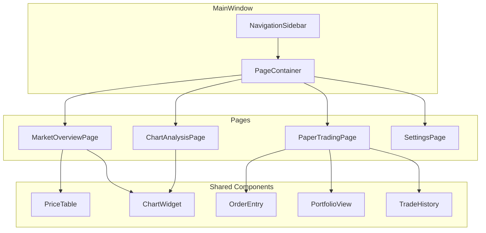

# Design Document: Sidebar Navigation System

## Overview

本設計文檔描述 Crypto Ticker 應用程式的側邊欄導航系統重構。將現有的多個 Dock Widget 整合為統一的頁面導航系統，使用圖標側邊欄進行頁面切換。

## Architecture



## Components and Interfaces

### 1. Navigation Sidebar (`app/ui/navigation.py`)

```python
from enum import Enum
from PySide6.QtWidgets import QWidget, QVBoxLayout, QPushButton
from PySide6.QtCore import Signal

class PageType(Enum):
    MARKET_OVERVIEW = "market"
    PAPER_TRADING = "trading"
    CHART_ANALYSIS = "chart"
    SETTINGS = "settings"

class NavigationSidebar(QWidget):
    """Vertical icon-based navigation sidebar."""
    
    pageSelected = Signal(PageType)
    
    def __init__(self, parent=None) -> None: ...
    
    def set_current_page(self, page: PageType) -> None:
        """Set the currently active page (updates highlight)."""
        ...
    
    def get_current_page(self) -> PageType:
        """Get the currently selected page."""
        ...
```

### 2. Page Container (`app/ui/page_container.py`)

```python
from PySide6.QtWidgets import QStackedWidget
from PySide6.QtCore import Signal

class PageContainer(QStackedWidget):
    """Container for page widgets with transition animations."""
    
    pageChanged = Signal(PageType)
    
    def __init__(self, parent=None) -> None: ...
    
    def add_page(self, page_type: PageType, widget: QWidget) -> None:
        """Register a page widget."""
        ...
    
    def switch_to(self, page_type: PageType, animate: bool = True) -> None:
        """Switch to the specified page with optional animation."""
        ...
    
    def get_current_page_type(self) -> PageType:
        """Get the current page type."""
        ...
```

### 3. Market Overview Page (`app/ui/pages/market_overview.py`)

```python
class MarketOverviewPage(QWidget):
    """Market overview page with price table and chart."""
    
    symbolSelected = Signal(str)
    
    def __init__(self, parent=None) -> None: ...
    
    def set_price_data(self, data: dict) -> None:
        """Update price data in the table."""
        ...
    
    def get_selected_symbol(self) -> str:
        """Get the currently selected symbol."""
        ...
```

### 4. Paper Trading Page (`app/ui/pages/paper_trading_page.py`)

```python
class PaperTradingFullPage(QWidget):
    """Full-page paper trading interface."""
    
    orderSubmitted = Signal(str, str, object, object)
    
    def __init__(
        self,
        portfolio: IPortfolioManager,
        order_service: IOrderService,
        data_provider: IDataProvider,
        parent=None
    ) -> None: ...
    
    def refresh(self) -> None:
        """Refresh all sections."""
        ...
    
    def set_symbol(self, symbol: str) -> None:
        """Set the trading symbol."""
        ...
```

### 5. Chart Analysis Page (`app/ui/pages/chart_analysis.py`)

```python
class ChartAnalysisPage(QWidget):
    """Full-page chart analysis interface."""
    
    def __init__(self, parent=None) -> None: ...
    
    def set_symbol(self, symbol: str) -> None:
        """Set the chart symbol."""
        ...
    
    def set_timeframe(self, timeframe: str) -> None:
        """Set the chart timeframe."""
        ...
    
    def update_data(self, data: list) -> None:
        """Update chart data."""
        ...
```

### 6. Settings Page (`app/ui/pages/settings.py`)

```python
class SettingsPage(QWidget):
    """Application settings page."""
    
    settingChanged = Signal(str, object)  # key, value
    
    def __init__(self, parent=None) -> None: ...
    
    def get_setting(self, key: str) -> object:
        """Get a setting value."""
        ...
    
    def set_setting(self, key: str, value: object) -> None:
        """Set a setting value."""
        ...
```

## Data Models

### Navigation State
```python
@dataclass
class NavigationState:
    current_page: PageType
    previous_page: Optional[PageType]
    is_transitioning: bool
```

### Settings Model
```python
@dataclass
class AppSettings:
    data_source: str  # "auto", "binance-ws", etc.
    theme_mode: str  # "dark", "light"
    accent_color: str  # hex color
    visible_columns: List[str]
    minimize_to_tray: bool
```

## Correctness Properties

*A property is a characteristic or behavior that should hold true across all valid executions of a system-essentially, a formal statement about what the system should do. Properties serve as the bridge between human-readable specifications and machine-verifiable correctness guarantees.*

### Property 1: Navigation state consistency
*For any* navigation action, the sidebar's highlighted icon SHALL always match the currently displayed page in the container.
**Validates: Requirements 1.4, 1.5**

### Property 2: Page switching completeness
*For any* valid PageType, calling switch_to() SHALL result in that page being displayed and the previous page being hidden.
**Validates: Requirements 1.4**

### Property 3: State preservation across navigation
*For any* sequence of page switches, the application state (portfolio balance, positions, settings) SHALL remain unchanged.
**Validates: Requirements 6.3**

### Property 4: Settings persistence round-trip
*For any* valid setting change, saving to storage and then loading SHALL produce the same setting value.
**Validates: Requirements 5.5**

### Property 5: Settings immediate application
*For any* setting change, the corresponding UI element SHALL reflect the new value without requiring page refresh.
**Validates: Requirements 5.4**

### Property 6: Responsive sidebar behavior
*For any* window width below 800 pixels, the sidebar width SHALL be less than or equal to the icon-only width (e.g., 60px).
**Validates: Requirements 7.1**

## Error Handling

### Navigation Errors
- **Invalid page type**: Log warning and stay on current page
- **Animation interruption**: Cancel current animation and start new transition
- **Widget not found**: Create default placeholder widget

### Settings Errors
- **Invalid setting value**: Revert to default value and log warning
- **Storage failure**: Show error message and keep in-memory value
- **Corrupted settings file**: Reset to defaults and log error

## Testing Strategy

### Property-Based Testing Framework
使用 **Hypothesis** 作為 Python 的屬性測試庫。

### Unit Tests
- Test NavigationSidebar button click handling
- Test PageContainer page switching
- Test SettingsPage value persistence
- Test responsive layout breakpoints

### Property-Based Tests
每個正確性屬性將實現為一個屬性測試：

```python
from hypothesis import given, strategies as st

# Example: Property 3 - State preservation across navigation
@given(
    page_sequence=st.lists(
        st.sampled_from(list(PageType)),
        min_size=1,
        max_size=10
    )
)
def test_state_preserved_across_navigation(page_sequence):
    """
    **Feature: sidebar-navigation, Property 3: State preservation across navigation**
    **Validates: Requirements 6.3**
    """
    # Arrange
    container = PageContainer()
    initial_state = capture_app_state()
    
    # Act
    for page in page_sequence:
        container.switch_to(page)
    
    # Assert
    final_state = capture_app_state()
    assert initial_state == final_state
```

### Test Configuration
- 每個屬性測試運行最少 100 次迭代
- 使用 `@settings(max_examples=100)` 配置
- 測試文件命名: `test_navigation_properties.py`

