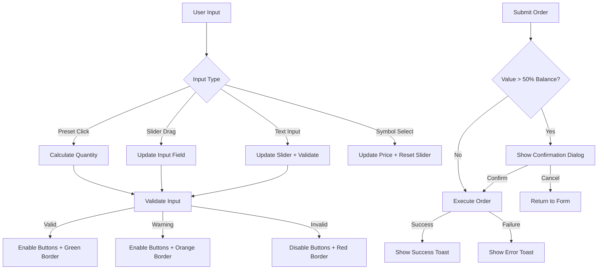

# Design Document: Paper Trading UI/UX Convenience

## Overview

本設計文件描述模擬交易 (Paper Trading) 頁面的 UI/UX 便利性改進。主要目標是提升交易效率和使用者體驗，透過快速下單預設、數量滑桿、輸入驗證回饋、訂單確認、鍵盤快捷鍵、Toast 通知、持倉快速操作和幣名下拉選單等功能。

## Architecture

### Component Hierarchy

```
PaperTradingFullPage
├── Header (existing)
├── OrderPanel (enhanced)
│   ├── SymbolInputWithDropdown (new)
│   │   ├── QLineEdit (symbol input)
│   │   └── SymbolDropdown (new)
│   ├── QuantityInputWithSlider (new)
│   │   ├── QLineEdit (quantity input)
│   │   ├── QSlider (quantity slider)
│   │   └── QuickPresetButtons (new)
│   ├── ValidationIndicator (new)
│   └── OrderButtons (enhanced with keyboard shortcuts)
├── PortfolioView (enhanced)
│   └── PositionRow (with close button)
├── TradeHistoryView (existing)
└── ToastManager (new - application level)
    └── ToastNotification (new)
```

### Signal Flow



## Components and Interfaces

### 1. QuickPresetButtons

```python
class QuickPresetButtons(QWidget):
    """Quick quantity preset buttons (25%, 50%, 75%, 100%)."""
    
    presetClicked = Signal(float)  # percentage as decimal (0.25, 0.5, 0.75, 1.0)
    
    def __init__(self, parent: Optional[QWidget] = None) -> None: ...
    def set_enabled(self, enabled: bool) -> None: ...
```

### 2. QuantitySlider

```python
class QuantitySlider(QWidget):
    """Quantity slider with bidirectional sync to input field."""
    
    valueChanged = Signal(Decimal)  # quantity value
    
    def __init__(self, parent: Optional[QWidget] = None) -> None: ...
    def set_range(self, min_val: Decimal, max_val: Decimal) -> None: ...
    def set_value(self, value: Decimal) -> None: ...
    def get_value(self) -> Decimal: ...
```

### 3. ValidationState (Enum)

```python
class ValidationState(Enum):
    """Input validation states."""
    VALID = "valid"           # Green border
    WARNING = "warning"       # Orange border (exceeds limits but valid format)
    INVALID = "invalid"       # Red border (invalid format)
    NEUTRAL = "neutral"       # Default border (empty/no validation)
```

### 4. InputValidator

```python
class InputValidator:
    """Validates order inputs and returns validation state."""
    
    def validate_quantity(
        self,
        quantity_str: str,
        order_type: str,  # "BUY" or "SELL"
        balance: Decimal,
        position_size: Decimal,
        current_price: Optional[Decimal],
    ) -> Tuple[ValidationState, str]:
        """Validate quantity input.
        
        Returns:
            Tuple of (ValidationState, message)
        """
        ...
```

### 5. SymbolDropdown

```python
class SymbolDropdown(QWidget):
    """Dropdown for quick symbol selection with filtering."""
    
    symbolSelected = Signal(str)  # selected symbol
    
    def __init__(self, parent: Optional[QWidget] = None) -> None: ...
    def set_symbols(self, symbols: List[str], prices: Dict[str, Decimal]) -> None: ...
    def filter_symbols(self, text: str) -> None: ...
    def show_dropdown(self) -> None: ...
    def hide_dropdown(self) -> None: ...
```

### 6. OrderConfirmationDialog

```python
class OrderConfirmationDialog(QDialog):
    """Confirmation dialog for large orders."""
    
    def __init__(
        self,
        symbol: str,
        order_type: str,
        quantity: Decimal,
        price: Decimal,
        total_value: Decimal,
        parent: Optional[QWidget] = None,
    ) -> None: ...
    
    def exec(self) -> bool:
        """Show dialog and return True if confirmed, False if cancelled."""
        ...
```

### 7. ToastNotification

```python
class ToastNotification(QFrame):
    """Single toast notification widget."""
    
    dismissed = Signal()
    
    def __init__(
        self,
        message: str,
        toast_type: str,  # "success", "error", "info"
        duration_ms: int = 4000,
        parent: Optional[QWidget] = None,
    ) -> None: ...
    
    def show_toast(self) -> None: ...
    def dismiss(self) -> None: ...
```

### 8. ToastManager

```python
class ToastManager(QObject):
    """Manages toast notification display and stacking."""
    
    def __init__(self, parent_widget: QWidget) -> None: ...
    def show_success(self, message: str) -> None: ...
    def show_error(self, message: str) -> None: ...
    def show_info(self, message: str) -> None: ...
```

### 9. QuantityCalculator

```python
class QuantityCalculator:
    """Calculates order quantities based on presets and context."""
    
    @staticmethod
    def calculate_buy_quantity(
        balance: Decimal,
        price: Decimal,
        percentage: float,
    ) -> Decimal:
        """Calculate buy quantity from balance percentage.
        
        Formula: quantity = (balance * percentage) / price
        """
        ...
    
    @staticmethod
    def calculate_sell_quantity(
        position_size: Decimal,
        percentage: float,
    ) -> Decimal:
        """Calculate sell quantity from position percentage.
        
        Formula: quantity = position_size * percentage
        """
        ...
```

## Data Models

### ToastData

```python
@dataclass
class ToastData:
    """Data for a toast notification."""
    message: str
    toast_type: str  # "success", "error", "info"
    timestamp: datetime
    duration_ms: int = 4000
```

### OrderPreview

```python
@dataclass
class OrderPreview:
    """Preview data for order confirmation."""
    symbol: str
    order_type: str
    quantity: Decimal
    price: Decimal
    total_value: Decimal
    balance_percentage: float  # percentage of balance this order represents
```

## Correctness Properties

*A property is a characteristic or behavior that should hold true across all valid executions of a system-essentially, a formal statement about what the system should do. Properties serve as the bridge between human-readable specifications and machine-verifiable correctness guarantees.*

Based on the prework analysis, the following properties have been identified:

### Property 1: Buy Quantity Preset Calculation

*For any* available balance, current price (> 0), and percentage (0.25, 0.5, 0.75, 1.0), the calculated buy quantity SHALL equal `(balance * percentage) / price`.

**Validates: Requirements 1.2**

### Property 2: Sell Quantity Preset Calculation

*For any* position size and percentage (0.25, 0.5, 0.75, 1.0), the calculated sell quantity SHALL equal `position_size * percentage`.

**Validates: Requirements 1.3**

### Property 3: Slider-Input Bidirectional Sync

*For any* valid quantity value, setting the slider SHALL update the input field to that value, AND setting the input field SHALL update the slider to that value.

**Validates: Requirements 2.2, 2.3**

### Property 4: Invalid Input Detection

*For any* quantity string that is negative, zero, or non-numeric, the validation state SHALL be INVALID.

**Validates: Requirements 3.1**

### Property 5: Buy Over-Budget Warning

*For any* buy quantity where `quantity * price > balance`, the validation state SHALL be WARNING.

**Validates: Requirements 3.2**

### Property 6: Sell Over-Position Warning

*For any* sell quantity where `quantity > position_size`, the validation state SHALL be WARNING.

**Validates: Requirements 3.3**

### Property 7: Valid Input Detection

*For any* quantity that is positive, numeric, and within limits (buy: `quantity * price <= balance`, sell: `quantity <= position_size`), the validation state SHALL be VALID.

**Validates: Requirements 3.4**

### Property 8: Large Order Confirmation Threshold

*For any* order where `total_value > balance * 0.5`, the confirmation dialog SHALL be displayed before execution.

**Validates: Requirements 4.1**

### Property 9: Close Position Pre-fill

*For any* position with symbol S and quantity Q, clicking the Close button SHALL pre-fill the order form with symbol=S, order_type=SELL, and quantity=Q.

**Validates: Requirements 7.2**

### Property 10: Close Button Color by P&L

*For any* position with unrealized P&L > 0, the Close button SHALL be green; *for any* position with unrealized P&L < 0, the Close button SHALL be red.

**Validates: Requirements 7.4**

### Property 11: Symbol Selection Updates

*For any* symbol selected from the dropdown, the symbol input field SHALL contain that symbol AND the price display SHALL show the current price for that symbol.

**Validates: Requirements 8.3**

### Property 12: Symbol Filter Matching

*For any* filter text, the dropdown SHALL display only symbols that contain the filter text (case-insensitive).

**Validates: Requirements 8.5**

## Error Handling

### Input Validation Errors

| Error Condition | Visual Feedback | User Action |
|----------------|-----------------|-------------|
| Empty quantity | Neutral border | Enter a value |
| Non-numeric quantity | Red border + tooltip | Enter valid number |
| Negative/zero quantity | Red border + tooltip | Enter positive number |
| Exceeds balance (buy) | Orange border + tooltip | Reduce quantity or add funds |
| Exceeds position (sell) | Orange border + tooltip | Reduce quantity |
| No price data | Disabled presets + tooltip | Wait for connection |
| Empty symbol | Disabled buttons | Enter symbol |

### Order Execution Errors

| Error Condition | Toast Type | Message |
|----------------|------------|---------|
| Insufficient balance | Error | "Insufficient balance for this order" |
| No position to sell | Error | "No position found for {symbol}" |
| Connection lost | Error | "Order failed: Connection lost" |
| Price unavailable | Error | "Cannot execute: Price data unavailable" |

## Testing Strategy

### Unit Testing

Unit tests will cover:
- `QuantityCalculator` calculation methods
- `InputValidator` validation logic
- `ToastManager` notification stacking
- Component initialization and state management

### Property-Based Testing

Property-based tests will use the **Hypothesis** library (already used in the project) to verify:
- Quantity calculation formulas (Properties 1, 2)
- Validation state determination (Properties 4, 5, 6, 7)
- Bidirectional sync behavior (Property 3)
- Threshold detection (Property 8)

Each property-based test will:
- Run a minimum of 100 iterations
- Be tagged with the format: `**Feature: ui-ux-convenience, Property {number}: {property_text}**`
- Reference the specific correctness property from this design document

### Integration Testing

Integration tests will verify:
- End-to-end order flow with confirmation dialog
- Toast notification display and auto-dismiss
- Keyboard shortcut handling
- Symbol dropdown filtering and selection

